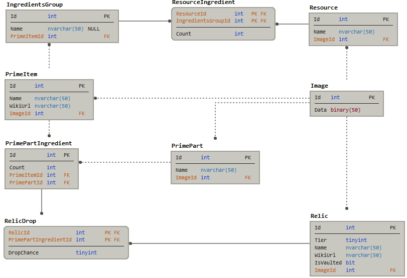

# Warframe Prime Tracker

Application to fetch all prime data including drop chance, relics, required resources and images.
The frontend is currently built to keep track of what item the user already has and which not.

## EF Core

Database management is done with Entity Framework Core.
Here are some helful commands.

* New migration: `dotnet ef migrations add <name> -s WfPrimeTracker.Server -p WfPrimeTracker.Data -c PrimeContext`
* Remove migration: `dotnet ef migrations remove -s WfPrimeTracker.Server -p WfPrimeTracker.Data -c PrimeContext`
* Apply migration: `dotnet ef database update -s WfPrimeTracker.Server -p WfPrimeTracker.Data -c PrimeContext`

Current database model is as follows:

Every item with a primary ID that is not a Foreign key is called a `PersistentItem`.
This means that it's ID is calculated based on its properties.
This ensures that updates work correctly and duplicated items is almost impossible.
It also helps in identifying newly added items (when a new Prime item comes out) and for the frontend to properly save data locally based on the ID without suddenly losing changes.

## TODO

* Add Wiki url links to Relics
* Sort options
* Improve colors on drop chance icons
* Look into different icons for drop chance icons
* Hide pictures option
* Save/copy option using probably a unique url linked to a specific user
